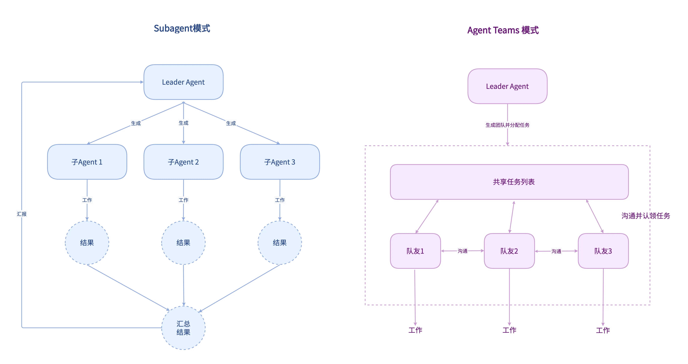

# 告别伪协作与高门槛：2026多智能体框架对比、痛点剖析与平民化真团队架构革新方案

## 一、为什么采用多智能体架构（对比单智能体核心优势）

随着 AI 应用从单一对话场景走向企业级复杂自动化、全链路业务决策场景，传统单智能体能力局限凸显，而早期多智能体方案高度依赖代码开发、专业运维，落地门槛极高。在此背景下，分工明确、容错性强、可规模化拓展的多智能体协作架构，成为 AI 进阶落地的核心方向。本文将从多智能体核心价值出发，对比 2026 年主流成熟框架，并聚焦去代码化、平民化、轻量化的革新方向，详解普通人可一键搭建、单人管理智能体团队的落地方案。

### 1\. 突破单智能体能力边界，实现专业分工

单智能体依赖单一大模型，需要同时兼顾理解、推理、工具调用、创作、审核、纠错等所有能力，存在 “全能但不专精” 的问题，复杂任务下极易出现逻辑混乱、细节遗漏。而多智能体采用角色化分工，将不同能力拆分给专属智能体，例如拆解出调研、分析、创作、审核、执行、测试等独立 Agent，每个智能体聚焦单一领域工作，大幅提升任务专业性与输出质量。

### 2\. 适配复杂分层任务，拆解落地更顺畅

企业级场景（软件开发、数据分析、全域内容创作、工业运维、智能办公）均为多层级、多步骤、强依赖的复杂任务，单智能体无法完成长链路、多分支、可回滚的流程处理。多智能体可通过统筹 Agent 拆解整体目标，将子任务分配给对应专业 Agent，支持串行、并行、迭代审核等多元协作模式，完美适配复杂业务流程。

### 3\. 容错性更强，支持迭代纠错

单智能体输出结果一次性成型，出错后只能整体重跑，缺乏纠错、审核、复盘机制。多智能体可搭建执行 \- 审核 \- 优化闭环，由执行 Agent 输出内容，Critic 审核 Agent 校验纠错，统筹 Agent 复盘优化，实现任务闭环迭代，大幅降低出错率，满足企业合规、精准输出的要求。

### 4\. 扩展性极高，灵活适配场景迭代

单智能体能力固定，新增业务场景、新增工具能力需要整体微调模型或重构代码。多智能体采用模块化设计，可按需新增、删除、替换专业 Agent，无需改动整体架构，能够快速适配场景更新，同时支持工具、权限、流程的独立配置，适配规模化落地需求。

### 5\. 资源利用率更高，降本增效

多智能体可实现 “小模型做执行、大模型做决策” 的分层调用策略，核心决策使用高精度大模型，重复性、机械性子任务使用轻量模型，相比单一大模型全量处理，大幅降低推理成本，提升运行效率。

当前行业所有多智能体框架，核心均基于两大基础协作模式衍生迭代，分别为集中式层级协作、去中心化平等协作，即Subagent 和 Agent Team模式，两种模式适配不同业务场景，也是各类框架的核心底层逻辑，现已被LangGraph、AutoGen等现代框架作为基础范式采纳。如下图所示：

## 二、当前主流多智能体框架介绍（2026 成熟方案对比）

目前行业主流多智能体框架均已实现工程化落地，适配不同开发难度、业务场景、团队规模。下表汇总各框架的核心特性、优势、短板及适配场景：

|框架名称|核心协作模式|核心优势|现存短板|适用场景|上手难度|
|---|---|---|---|---|---|
|CrewAI|角色化集中协作，固定团队分工、任务逐级落地|开箱即用角色模板，API 极简，天然适配团队协作逻辑，支持任务持久化、结果质控，新手友好，生态成熟|复杂分支、循环流程支持较弱，动态任务适配能力不足|内容创作、市场调研、标准化办公流程、常规业务自动化|极低|
|LangGraph|状态图驱动协作，支持分支、循环、并行、断点续跑|状态管理能力行业顶尖，支持事务回滚、流程定制，无缝对接 LangChain 全生态，生产环境稳定性拉满|需要掌握状态机、图逻辑，学习曲线较陡，定制开发成本高|企业级复杂工作流、合规 RAG 系统、审批流程、长链路自动化任务|中等偏高|
|AutoGen（微软）|去中心化对话协作，多 Agent 自由群聊、自主协商共识|协作灵活性极强，无固定流程约束，支持任意数量 Agent 联动，适配开放性问题探索|执行路径不可控，调试难度大，无法严格管控流程，不适合强合规场景|创意研讨、复杂问题拆解、多领域交叉探索、开放式决策|中等|
|MetaGPT|标准化 SOP 层级协作，复刻企业软件团队工作流程|领域专业性极强，内置完整行业 SOP、文档模板，全链路自动化能力突出，落地效果稳定|高度绑定软件工程场景，跨领域适配需要大幅改造模板，通用性差|全流程软件开发、技术文档生成、代码迭代与测试|中等|
|OpenAI Swarm|轻量接力式协作，Agent 按需转接任务、动态调度|极简架构、零复杂配置、代码量极少，启动速度快，深度适配 OpenAI 生态|无复杂流程管控能力，不支持循环、分支，仅适配简单任务分发|轻量任务分发、快速原型验证、小型自动化工具|极低|
|Semantic Kernel|技能化编排协作，多 Agent 技能组合、统一内核调度|企业级安全性、合规性完善，深度对接 Azure 生态，支持多语言开发，适配传统企业系统集成|生态封闭，灵活性偏低，自定义协作逻辑成本高|企业 RPA、智能客服、传统业务系统 AI 升级|中等偏高|

## 三、典型案例深度解析：CrewAI 协作模式与真实团队的差距辨析

这里拿 Github 上 52\.3 星（20260527）的 CrewAI 进行调研，分析当前主流多 Agent 协作与真正 “团队” 的异同点。

### 3\.1 CrewAI 核心协作运作模式

作为角色化集中协作框架的典型代表，CrewAI 依靠Agent、Task、Crew、Process四大核心单元搭建协作体系，这也是当前多数入门级多智能体框架的通用设计思路。

每一个智能体被赋予专属角色、工作目标与能力边界，对应现实职场中的岗位分工；任务单元则明确工作内容、输出标准与依赖关系，所有智能体和任务统一归属于 Crew 团队容器。框架提供两种主流执行流程：顺序流程按照预设流水线逐步推进任务，前序输出直接作为后序输入；分层流程会自动生成管理型智能体，完成目标拆解、任务派发、结果审核，模拟企业 “管理层 \+ 执行层” 的组织形态。

同时框架开放了基础协作能力，智能体之间可完成任务委派、跨角色问询，实现简单的信息互通与工作转交，整体逻辑高度贴合标准化办公、内容生产等固定流程场景，这也是它上手门槛低、生态普及度高的核心原因。

### 3\.2 CrewAI 现存问题与核心弊端

依托固定架构实现轻量化协作的同时，CrewAI 也暴露了当前同类框架普遍存在的短板，集中体现在协作灵活性、运行稳定性与场景适配能力上：

#### 流程固化，动态适配能力弱

框架仅支持顺序、分层两种基础流程，原生缺少复杂分支、循环、随机跳转等逻辑，面对非结构化、需求多变的业务场景很难自主调整，只能依靠前期大量人工配置。

#### 交互形式单一，属于 “指令式伪协作”

智能体之间的交互仅停留在 “下达指令 \- 接收执行” 的单向流转，没有对等沟通、观点博弈、方案探讨的能力，无法针对分歧展开协商，一旦出现输出结果不一致，只能人工介入修正。

#### 状态管理与可观测性不足

多智能体协同过程中，共享上下文容易持续膨胀，存在上下文丢失、状态不同步的问题；且协作过程可视化程度低，日志信息简略，任务出错后定位问题、调试排障成本较高。

#### 运行成本与稳定性有局限

每一次智能体交互、工具调用都会产生大量 Token 消耗，复杂长任务下运行成本偏高；分层模式中的管理智能体决策质量不稳定，复杂任务场景下容易出现任务派发失误、审核标准跑偏等问题。

#### 扩展能力偏基础

工具权限、角色能力的配置方式较为粗放，缺少精细化的权限管控与大规模集群协作设计，难以直接承接超复杂、高安全要求的企业级核心业务。

### 3\.3 多 Agent 协作与人类真实 “团队” 的异同对比

以 CrewAI 为样本，可以清晰看出当前主流多智能体框架，仅复刻了人类团队的外在形态，并未实现真正意义上的团队协作，二者异同总结如下：

#### 3\.3\.1 二者的相似点（形态层面）

##### 明确分工与统一目标

无论是 AI 智能体还是人类团队，都会基于整体目标拆分岗位与职责，成员各司其职，围绕最终产出开展工作，避免重复劳作与目标偏离。

##### 层级管理与任务流转

支持上下级管理、任务分发、成果汇总、多级审核等流程，完整复刻了职场团队的基础工作流转模式。

##### 基础信息互通

成员之间可以传递资料、咨询问题、转交工作，满足团队协作最基本的信息共享需求。

#### 3\.3\.2 二者的核心差异（本质层面）

##### 沟通逻辑不同

人类团队是双向、柔性沟通，允许模糊表达、观点碰撞、头脑风暴；而 AI 多智能体是单向、刚性指令流转，所有交互都限定在预设规则内，无自由讨论与创意共创能力。

##### 冲突处理能力不同

人类团队可通过沟通、妥协、协商化解分歧，自主达成共识；当前 AI 框架普遍缺少冲突检测与调解机制，出现矛盾或结果偏差时无法自主处理，高度依赖外部人工干预。

##### 成长与进化能力不同

人类团队会在一次次协作中积累经验、磨合默契、迭代工作方法，整体能力持续成长；AI 智能体角色、能力、逻辑均为静态配置，无法从历史协作记录中自主学习、优化工作方式。

##### 协作底层逻辑不同

人类团队存在信任、默契、责任意识等软性联结，面对突发状况可以灵活补位、主动兜底；AI 智能体仅按照代码与模型规则执行任务，无主观意识与协作默契，不会主动补位、主动优化。

##### 创新与应变能力不同

真实团队可突破固有流程，根据现场情况调整方案、产出创新思路；AI 多智能体严格受限于预设流程与任务边界，难以应对突发需求、开放性探索类工作。

### 3\.4 小节总结

CrewAI 是当前轻量化多智能体框架的典型缩影：它用极低的开发门槛，完整模拟出人类团队分工、流程、层级等外在特征，能够高效落地标准化、流程化的重复性工作；但受限于底层架构与大模型能力，始终停留在 “工作组” 阶段，距离具备自主思考、协商博弈、持续进化的真正团队还有极大差距。

这也是目前整个多智能体赛道的共性问题：现有框架大多偏向 “工程化流程编排”，而非 “类人团队协作”。想要让多智能体真正走向平民化、大众化落地，不仅要继续降低代码门槛，更要突破现有协作逻辑的局限。

## 四、多智能体未来展望与低门槛改进方案

通过第三章对 CrewAI 的深度调研可明确：当前主流多智能体框架仅实现了形式化的团队分工与流程编排，本质是 “自动化工作组”，存在协作模式固化、单向伪协作、无自主进化、冲突被动处理等核心缺陷。同时，这类框架普遍依赖代码开发、专业运维，落地门槛极高，普通业务人员无法独立搭建、调配、管理智能体团队，极大限制了多智能体技术的普及落地。

因此，行业未来的革新是双重升级：一是表层门槛革新，彻底摆脱代码依赖，实现平民化、零代码、轻量化落地；二是底层协作革新，打破固定流程与伪协作模式，补齐真实团队的协商、进化、容错能力，从 “流程编排工具” 真正走向 “类人智能团队”。本章将结合现存痛点，拆解行业未来趋势与可落地的优化方案。

### 1\. 行业整体未来发展展望

#### （1）零代码可视化搭建成为主流，彻底消解开发门槛

传统多智能体搭建高度依赖 Python 编码、状态机配置、流程代码调试，必须由专业开发人员操作。未来行业将全面转向可视化画布搭建模式，彻底摒弃代码开发逻辑，将智能体创建、角色定义、权责划分、流程编排、分支循环配置全部可视化。普通用户仅通过拖拽组件、点击配置、填写自然语言参数，即可完成整套智能体团队搭建，让多智能体搭建从 “专业开发工作” 转变为 “普通配置工作”。

#### （2）标准化场景模板沉淀，实现开箱即用落地

针对现有框架需从零定制 Agent、调试流程、配置权限的繁琐问题，未来行业将沉淀海量垂直领域标准化智能体团队模板，全面覆盖办公自动化、全域内容创作、市场调研、数据分析、软件研发、工业运维等高频场景。模板内置成熟的角色分工、协作流程、审核机制与工具权限，用户无需专业认知，仅修改核心任务目标即可一键上线，大幅降低场景落地成本。

#### （3）协作逻辑从 “固定编排” 升级为 “动态自适应”

解决 CrewAI 等主流框架流程固化、无法适配复杂可变场景的核心短板，未来多智能体将打破顺序、分层两种固定模式，支持自主动态流程调整。系统可根据任务难度、执行进度、输出偏差，自动触发分支、循环、迭代纠错，自主调整智能体分工与协作节奏，适配非结构化、高不确定性的复杂业务场景，告别人工前置配置固化流程的弊端。

#### （4）从 “单向伪协作” 升级为 “类人团队真协作”

颠覆当前智能体 “指令 \- 执行” 的单向被动交互模式，补齐真实团队核心能力。未来多智能体将具备对等协商、观点博弈、冲突自解、主动补位能力，支持多智能体自由研讨、方案共创、分歧调解，不再依赖人工干预修正偏差。同时搭载团队记忆机制，可从协作历史中沉淀经验、优化工作方法，实现团队整体能力的自主进化。

#### （5）跨框架标准化互通，打破生态壁垒

依托 MCP 等通用智能体通信协议，解决当前各框架独立封闭、无法互通的问题。实现 CrewAI、LangGraph、AutoGen 等不同架构智能体的自由组合、能力混搭、跨工具联动，用户可按需整合各框架优势能力，无需绑定单一生态，最大化适配个性化、复合型业务需求。

#### （6）轻量化免运维，单人全流程管控成熟

优化智能体调度、资源消耗、异常处理机制，解决传统框架运维复杂、调试困难、Token 成本高、易出错的痛点。最终实现单人可批量管理数十个智能体团队，系统自主完成冲突修复、错误重试、资源优化、进度复盘，全程无需人工介入底层逻辑，仅需把控核心输出结果。

### 2\. 核心落地改进方案（兼顾低门槛平民化 \+ 真团队协作）

结合前文梳理的框架短板与行业趋势，从搭建、配置、协作、运行、运维、部署六大维度，落地轻量化、平民化、类团队化的优化方案，既降低普通人使用门槛，又补齐传统多智能体 “伪团队” 的核心缺陷。

#### （1）零代码可视化拖拽，10 分钟快速搭团队

搭建轻量化可视化操作后台，内置标准化智能体组件库与流程组件库，涵盖统筹、执行、创作、审核、测试、调度等全岗位 Agent 组件，以及串行、并行、循环、分支、迭代等全流程组件。用户无需编写任何代码，直接拖拽生成智能体角色，连线配置任务流转逻辑，可视化定义团队架构与协作规则，彻底告别编码开发，普通人可快速完成整套多智能体系统搭建。

#### （2）全场景预制模板，一键开箱即用

沉淀可直接复用的智能体团队模板库，覆盖通用办公、内容生产、市场调研、数据分析、软件开发、设备运维等主流场景。每套模板均内置成熟的角色分工、SOP 流程、审核标准、工具权限与纠错机制，完美规避传统框架需人工调试协作逻辑的问题。非专业用户选择对应场景模板后，仅需输入任务目标、交付要求，即可一键启动智能体团队工作，同时支持自定义保存、迭代专属模板，适配个性化场景需求。

#### （3）自然语言极简配置，傻瓜式自定义迭代

摒弃传统框架复杂的模型参数、状态配置、权限代码、流程规则编写，将所有配置轻量化、可视化、自然语言化。用户仅需填写团队核心目标、各角色岗位职责、输出质量标准、审核校验规则、执行时效要求等基础内容，系统可自主解析需求，自动生成智能体运行逻辑、分工规则与协作机制，无需理解底层技术原理，即可完成个性化团队定制。

#### （4）重构协作机制，实现真正类团队协作

针对性解决 CrewAI 等框架单向伪协作、无冲突处理、无进化能力的核心弊端，升级底层协作逻辑：一是增加对等协商机制，支持多智能体自由对话、观点碰撞、方案共创，替代单一指令流转；二是搭载自主冲突调解模块，自动检测输出分歧、任务优先级冲突、流程卡顿，自主协商达成最优结果；三是新增团队记忆与进化系统，沉淀每一次协作的问题、经验、优质方案，持续优化分工模式与输出质量，实现团队自主迭代成长；四是优化动态调度能力，可根据任务进度自主补位、调整分工，适配复杂多变的业务场景。

#### （5）全自动智能运维，单人轻松管控全流程

搭建一体化可视化运维监控面板，整合任务进度实时展示、异常自动告警、错误自主重试、冲突自动修复、结果自动复盘、Token 成本统计等功能。系统可自主完成智能体调度、资源分配、流程纠错、合规校验，全程无需人工干预底层运行逻辑。用户仅需查看整体进度、审核核心交付成果，即可实现单人管理多套 AI 智能体团队，彻底解决传统框架运维复杂、排障困难、需要专业人员值守的痛点。

#### （6）轻量化免环境部署，全终端适配

优化底层部署架构，彻底消除落地门槛，支持网页端、客户端一键部署运行。无需配置 Python 环境、无需安装依赖、无需服务器运维，普通电脑、手机等终端均可稳定运行多智能体团队，让多智能体技术彻底脱离专业技术环境限制，真正走向全民可用。

## 五、总结

相较于能力单一、容错性差、无法适配复杂长链路任务的单智能体，多智能体架构凭借专业化角色分工、复杂任务分层拆解、执行 \- 审核 \- 迭代闭环、高可扩展性、高低成本资源调度的核心优势，成为 AI 从单点对话走向企业级全链路自动化、规模化落地的核心形态。

2026 年主流多智能体框架各有所长：CrewAI 轻量化、易上手，适配标准化办公场景；LangGraph 流程稳定性强、适配企业复杂合规流程；AutoGen 灵活性高、适合开放式探索；MetaGPT 深耕软件工程垂直领域。但以 CrewAI 为典型代表的现有框架，均存在行业共性短板：仅复刻了人类团队的分工、层级、流程等外在形态，缺失协商共创、冲突自解、自主进化、主动补位的核心团队能力，本质是自动化工作组，而非真正意义上的智能团队。

未来多智能体技术的革新将围绕 **「门槛平民化 \+ 协作真实化」** 双核心推进：一方面通过零代码可视化、标准化模板、全自动运维、轻量化部署，彻底消解代码与运维门槛，让普通人可自主搭建、一键部署、全程管理专属智能体团队；另一方面重构底层协作逻辑，补齐真实团队的柔性沟通、自主迭代、动态适配、冲突调解能力，推动多智能体从 “流程编排工具” 向 “可自主进化的类人智能团队” 升级。

基于上述革新理念，可落地一套通用、轻量化、平民化的标准多智能体团队架构，彻底解决传统框架伪协作、高门槛、无进化、难运维的痛点，实现从理论革新到工程落地的完整闭环，让类人智能团队真正落地到个人与企业全场景。随着平民化与底层协作技术的持续突破，多智能体将彻底摆脱专业技术壁垒，全面渗透个人、中小企业、大型企业全场景，成为 AI 规模化落地、全域自动化的核心基础设施。

