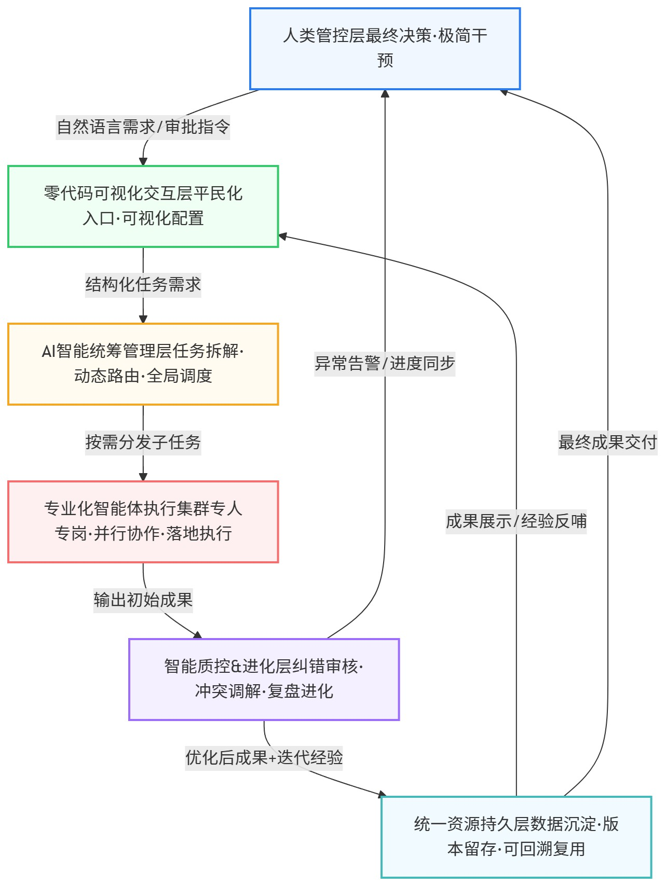

# 落地实现：通用平民化多智能体团队架构（可工程落地）

## 一、架构设计核心理念

本架构基于前文对CrewAI等主流框架的痛点复盘（流程固化、单向伪协作、无冲突自解、无自主进化、代码门槛高），以及**多智能体平民化、真实团队化、免运维自适应**的未来趋势设计。

保留原始「人类管控-智能统筹-集群执行-资源沉淀」的五层核心逻辑，同时完成两大核心升级：

1. **场景通用化**：从单一代码研发场景，升级为适配内容创作、数据分析、办公自动化、项目研发、运维管理的全场景通用架构；

2. **协作真实化**：补齐传统框架"伪团队"缺陷，增加质控协商、冲突调解、团队记忆、自主迭代能力，从「流程编排工作组」升级为「自进化AI智能团队」。

## 二、整体六层架构总览（从上至下闭环）

**人类管控层 → 可视化人机交互层 → AI统筹管理层 → 专业化智能体执行集群 → 质控进化层 → 统一资源持久层**

相较于传统架构，新增**智能质控进化层**，专门解决CrewAI无纠错、无复盘、无进化、协作单向化的核心弊端，形成「需求输入-智能拆解-分工执行-审核纠错-迭代进化-资源沉淀」的完整闭环。整体架构流转逻辑如下图所示：

## 三、分层详细架构与职责说明

### 第1层：人类管控层（最终决策 & 极简干预）

**核心定位**：团队负责人，只做目标定义、关键审批、结果验收，不干预底层流程

**核心能力**：

- 自然语言输入整体任务目标、输出标准、行业规则；

- 查看全流程可视化进度、异常告警；

- 审批关键节点成果、驳回修改、终止/重启任务；

- 无需代码、无需运维，全程傻瓜式管控。

**解决痛点**：传统框架依赖开发运维、普通人无法管控智能体团队的落地门槛问题

### 第2层：零代码可视化交互层（平民化入口）

**核心载体**：网页可视化控制台（拖拽搭建、模板一键启用、流程可视化）

**核心能力**：

- 内置全场景智能体团队模板，一键生成团队架构；

- 可视化拖拽编排流程，支持串行、并行、分支、循环、迭代；

- 实时展示各Agent工作状态、任务进度、报错信息、成本消耗；

- 所有配置自然语言化，零代码完成团队自定义。

**解决痛点**：传统框架编码搭建、学习曲线陡、无法快速定制的问题

### 第3层：AI智能统筹管理层（团队CEO｜替代固定流程编排）

**核心定位**：动态团队管理者，彻底解决CrewAI流程固化、静态分工、无动态调度的短板

**核心智能体：统筹调度AI**

**核心能力**：

- **需求智能拆解**：将复杂整体目标，自主拆解为标准化、可落地、有依赖关系的子任务；

- **动态路由分发**：根据任务类型、难度、各Agent负载，智能分配对应专业执行Agent，不局限固定流程；

- **任务优先级管控**：自主处理任务冲突、流程卡顿、资源抢占问题；

- **全流程进度把控**：实时监控执行状态，异常自动触发重试、补位、流程调整。

**核心升级**：告别CrewAI固定顺序/分层死板流程，实现**动态自适应流程调度**

### 第4层：专业化智能体执行集群（团队执行层｜可插拔扩展）

**核心定位**：岗位专精执行团队，模块化、可插拔、按需增减角色，适配全业务场景

摒弃单一研发场景限制，通用标准化执行Agent体系，用户可按需组合：

**通用基础执行角色（全覆盖）**：

- 内容创作AI、数据分析AI、市场调研AI、文案优化AI；

- 前端研发AI、后端研发AI、测试AI、运维AI；

- 办公自动化AI、报表生成AI、合规校验AI。

**核心能力**：专人专岗、专精执行、工具调用、细节落地，规避单智能体"全能不专精"问题

**协作模式升级**：支持Agent间**对等问询、工作转交、协同补位**，不再是单向指令执行

### 第5层：智能质控 & 进化层（核心创新｜解决伪团队痛点）

**核心定位**：传统多智能体完全缺失的核心层级，实现「真团队协作、自纠错、自进化」

**核心智能体：审核质控AI + 冲突调解AI + 复盘进化AI**

**核心能力**：

- **结果质控纠错**：对所有执行成果进行校验、纠错、优化，形成执行-审核-优化闭环；

- **冲突自主调解**：解决多Agent输出分歧、方案冲突、流程矛盾，自主协商达成共识，无需人工干预；

- **团队记忆沉淀**：记录每一次任务的执行经验、错误问题、优质方案；

- **自主迭代进化**：基于历史数据优化分工逻辑、执行标准、协作方式，实现团队能力持续成长。

**核心价值**：彻底解决CrewAI**伪协作、无冲突处理、无进化能力、出错需人工修正**的行业共性短板

### 第6层：统一资源持久层（全局数据沉淀）

**核心载体**：统一智能体工作区（本地/云端双适配）

**核心存储内容**：

- 各类产出成果：代码、文档、报表、文案、调研数据；

- 全流程版本记录、操作日志、报错记录；

- 团队协作记忆、历史模板、优化迭代记录；

- Token消耗、运行成本、运维数据。

**核心能力**：持久化沉淀、可回溯、可复用、可迭代，为团队进化提供数据支撑

## 四、架构核心优势（对标传统CrewAI等框架）

1. **告别伪团队，实现真协作**：具备协商、调解、复盘、进化能力，不再是死板流程编排；

2. **全场景通用**：从单一代码开发，覆盖所有办公、创作、研发、分析场景；

3. **真正平民化零代码**：全程可视化配置、模板一键启用，普通人可独立搭建管理；

4. **动态自适应流程**：打破固定顺序/分层流程，自主适配复杂、不确定业务场景；

5. **全自动免运维**：自主纠错、自主排障、自主迭代，单人可管控整套AI团队。

## 五、架构极简运行闭环

人类输入需求 → 可视化控制台接收 → 统筹AI拆解任务+动态分发 → 执行AI集群分工落地 → 质控层审核纠错+冲突调解 → 复盘进化层沉淀经验 → 统一工作区持久化存储 → 人类验收成果
